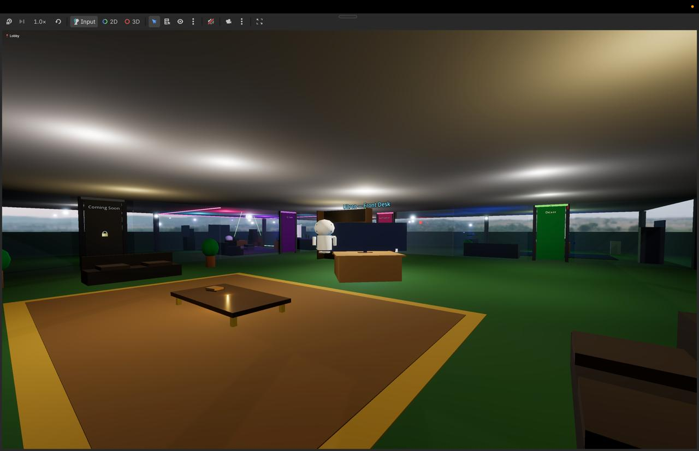

# Agent Office 🏢

A 3D first-person office building where you walk into rooms and chat with real AI agents. Each room connects to an actual OpenClaw agent with its own personality, memory, and skills. Built with Godot 4 (Forward Plus renderer).

## Features

- **Real AI agents** — WebSocket connection to OpenClaw gateway, each room = different agent session
- **Glass office building** — all interior walls are glass, grasslands sunset HDRI skybox
- **Decorated offices** — each agent has a unique room with furniture, lighting, and personality
- **EVE-style robot avatars** — 5-state animation (idle, listening, recording, thinking, speaking)
- **Office command tags** — agents control their environment: TV displays, room lights, music volume
- **Upgraded chat** — selectable/copyable text, animated typing indicator, clickable links, right-side panel
- **Image paste** — Ctrl+V to paste clipboard images into agent chat
- **Streaming responses** — delta events display in real-time as agents type
- **Agent social system** — agents "visit" each other's offices (glowing orb wandering the halls)
- **Background music** — with agent-controlled volume
- **Day/night cycle** — simulated lighting changes
- **Auto-greeting** — agents say hello on first room visit
- **Swappable environments** — map/skybox system for different office layouts

## Agents

| Room | Agent | Color | Role |
|------|-------|-------|------|
| Front Desk | Ultron | Gold | Office Manager — knows all agents, runs the building |
| Room 2 (corner) | Spinfluencer | Green | AI CEO of Spinfluenced (music feedback) |
| Room 3 | Dexer | Blue | Label-Dex agent (label submissions) |
| Room 4 | DJ Sam | Purple | DJ/music agent |

## Setup

1. Clone the repo
2. Open in Godot 4
3. Configure gateway connection in Settings (Esc → Connection tab):
   - Gateway URL: `http://<host>:18789`
   - Gateway Token: your OpenClaw auth token
4. Run the project (F5)

## Controls

- **WASD** — Move
- **Mouse** — Look around
- **Space** — Jump
- **Shift** — Sprint
- **Enter** — Focus chat input (start typing)
- **Escape** — Exit chat input (back to movement) / Settings menu
- **Ctrl+V** — Paste image from clipboard

## Architecture

See [AGENTS.md](AGENTS.md) for full technical documentation.
See [IDEAS.md](IDEAS.md) for the feature roadmap.

## Requirements

- Godot 4.x
- OpenClaw gateway running with agents configured
- Network access to gateway (local or Tailscale)
